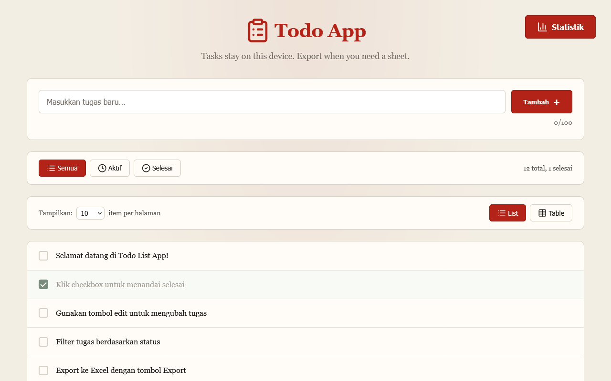

# Todo App

A small todo list that runs in the browser. Tasks stay on your machine; export to Excel when you need a spreadsheet.



**Live demo:** [https://rogue-dev-studio.github.io/todo-app/](https://rogue-dev-studio.github.io/todo-app/)

## Highlights
- Add, edit, complete, delete
- Filter + list/table view
- Export Excel or JSON

## Run
Open `index.html` locally (Live Server on port **5500**), or use the live demo above.

```bash
git clone https://github.com/rogue-dev-studio/todo-app.git
```

By [Aris Hadisopiyan](https://rogue-dev-studio.github.io/) / Rogue Dev Studio.

MIT
